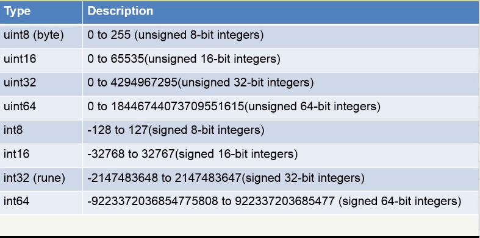

# Introduction
- Developed by Google in 2007, it was announced in 2009
- General purpose programming languaje
- Open source
- Clean, expressive, concise, and efficient syntax

## Key feautes
- Well-documented library
- Ideal for multicore applications and for network services 
- It is ideally suited for modular software design
- Compiles rapidly
- Supports run-time reflection includinf flexibility (this referes to the capability of a program to inspect or investigate its own structure) 

## Installing (windows)
  
  - download in https://golang.org/dl/ and install
  - check in the cmd using "go version" command
  
  
 # Hello World
- Create a file named hello.go

- Copy the code
```go
package main // package main is a special package, it tells that it's an executable program

import "fmt" // format package, contains functions for formatting output

// entry point for this program,
func main() { // important: curly brace has to be on the same line as your function declaration

	fmt.Println("Hello World") // print Hello World
}
```

- To compile and run it type `go run ./hello.go` in the cmd

# Variables

 ```go
 package main

import "fmt"

// variables could be declares in package scope
// using var variableName dataType
// or passing a value and the compiler infer the type
var hello = "Hello World"

// you can declare multiple variables at once.
var a1, a2 int

//Variables declared without a corresponding initialization are zero-valued.
//For example, the zero value for an int is 0. false for bool and "" for string

func main() {

	// you can use de := shorthand for declaring and initializing variables
	// but only in function scope
	bye := "Bye World"

	a1 = 1
	a2 = 2

	// declaring a constant value
	const notChange bool = true

	fmt.Println(a1, hello)
	fmt.Println(a2, bye)
}
```

# Functions and parameters by 'value' and 'reference'

 ```go
package main

import "fmt"

// in this function the value of 'y' is passed as a copy (by value)
// it means that if you change 'y' inside the function
// the value is set in the local function only
func fun(y int) {
	y = 0
}

// in this case the parameter is a pointer (by reference)
// if we change the value that the pointer points
// the change will be reflected in the main function
func funWithPtr(yPtr *int) {

	// the * basically means that we're providing acces
	// to the underlying value that the pointer points to
	// in this case we are store the value 0 in the memory
	// location pointer to by "y" pointer
	*yPtr = 0
}

func main() {

	// declaring a variable
	y := 10

	// passing variable as a copy
	fun(y)

	// in this case, it will print 10
	fmt.Println(y)

	// using the & operator, what this does is it basically causes
	// us to send the memory location (a pointer)
	funWithPtr(&y)

	// in this case, it will print 0
	fmt.Println(y)
}
```

# Operator 'new'

 ```go
package main

import "fmt"

func funWithPtr(yPtr *int) {
	// changing the value
	*yPtr = 5
}

func main() {

	// we use the operator 'new' to obtain a pointer
	// you pass a type as an argument and then it allocates
	// enough  memory for a value of the type passed to it and
	// returns a pointer to that memory location
	y := new(int)

	// calling the function sending a memory address
	funWithPtr(y)

	// in this case, it will print 5
	fmt.Println(*y)
}
```
# Types

## integer types



  

 
